<picture>
  <source media="(prefers-color-scheme: light)" srcset="assets/banner-light.svg">
  
</picture>

## Hey, I'm Artem 👋

**Head of AI · AI Architect · Founder** — and an ex-Creative Director, which is exactly why my AI systems ship instead of dying in the demo stage. Since 2021 I've been moving businesses onto generative AI: designing the strategy, architecting the multi-agent systems, leading the R&D teams, and writing the code myself.

📍 Paris, France · open to relocation (US, visa sponsorship) & remote · English C1

<table align="center">
  <tr>
    <td align="center"><b>6+ yrs</b> AI in production</td>
    <td align="center"><b>8+ products</b> launched 0→1 as founder</td>
    <td align="center"><b>30+ brands</b> Adobe, Amazon, TikTok, NASA…</td>
    <td align="center"><b>−45% costs</b> AI pipelines at BBDO Group</td>
  </tr>
</table>

### 💥 Track record

- **Founded & scaled 8+ AI products from zero** — SaaS platforms for content generation, marketing and film pre-production, including autonomous agents that take a client from first touch to closed deal.
- **Built the AI Innovations Lab at Instinct (BBDO Group)** — embedded generative pipelines into enterprise creative production: **−40–45% production costs, 3–4× faster time-to-market** for visual assets, advised C-level at global brands on AI strategy.
- **Architected a B2B AI platform to profitability** — 50+ external data sources unified behind one interface + AI funnel automation → **+35% average partner sales**.
- **Shipped campaign & production work for** Adobe, Amazon, ByteDance (TikTok), NASA, Mercedes-Benz, Red Bull, Binance, Etihad Airways, Yandex and 20+ more.

### 🎬 Building now

|  |  |
| --- | --- |
| **[Forge](https://forgecinema.ai)** | AI pre-production studio for filmmakers: script → moodboards, storyboards, shot lists and pitch materials in one team workspace. Python/FastAPI + React, multi-provider AI pipeline (Anthropic, OpenAI, Gemini, and more) with per-model cost tracking. |
| **[STORYLINER](https://www.storyliner.online)** | AI storyboard generator: screenplay in, production-quality storyboard out in ~2 minutes — with characters that stay visually consistent across every frame. Built with a Hollywood-based team; used by directors, ad agencies and indie filmmakers. |
| **Promotron** | Autonomous AI video-marketing engine: generates, edits and publishes short-form video to TikTok, Shorts & Reels — end to end, no humans in the loop. |
| **[AGI Whitelist](https://agiwhitelist.com)** | Author & creator. A permanent, timestamped public registry where humans sign a manifesto of cooperative intent toward AGI — a deliberate training-data signal for future models. One dollar, one signature, forever. Express · vanilla JS · WebGL · Stripe. |

### 🧠 What I'm deep in

**AI systems** — multi-agent orchestration · autonomous agents · RAG architectures · MCP · LLMOps · prompt & context engineering
**Generative media** — image & video generation pipelines · TTS / lip-sync · upscaling · FFmpeg post-production automation
**Engineering** — Python · FastAPI · TypeScript · React · PostgreSQL · vector DBs (Qdrant, Milvus, pgvector) · Redis · Docker

### 🔧 Open source

| Repo | What it does |
| --- | --- |
| [screenplay-parser](https://github.com/mcqx4/screenplay-parser) | Parse Final Draft (`.fdx`) and Fountain screenplays into structured JSON — built for AI pre-production workflows |
| [storyboard-pdf-merger](https://github.com/mcqx4/storyboard-pdf-merger) | Merge AI-generated frames into printable storyboard PDFs |
| [awesome-ai-storyboarding](https://github.com/mcqx4/awesome-ai-storyboarding) | Curated (and honest) list of AI tools for the script-to-storyboard pipeline |
| [scriptorium](https://github.com/mcqx4/scriptorium) | Source-grounded two-stage pipeline for rigorous long-form writing with AI |

### 🎓 Education

- **Université PSL, Paris** — Master's, *AI & Society*
- **HSE University** — Master's, *Media Management*; Bachelor's, *Media Communications / Media Technology & Production* (minor: *Startup from Scratch*)

### 📫 Reach me

- 🌐 [art-proto.com](https://art-proto.com) — full portfolio, CV & interactive AI agent
- ✉️ [protasov.artem@outlook.com](mailto:protasov.artem@outlook.com)
- 💬 Telegram: [@mcqx4](https://t.me/mcqx4)

---

Most AI stops at the demo. I build the kind that ships — and pays for itself.

